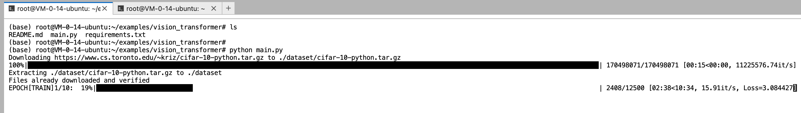
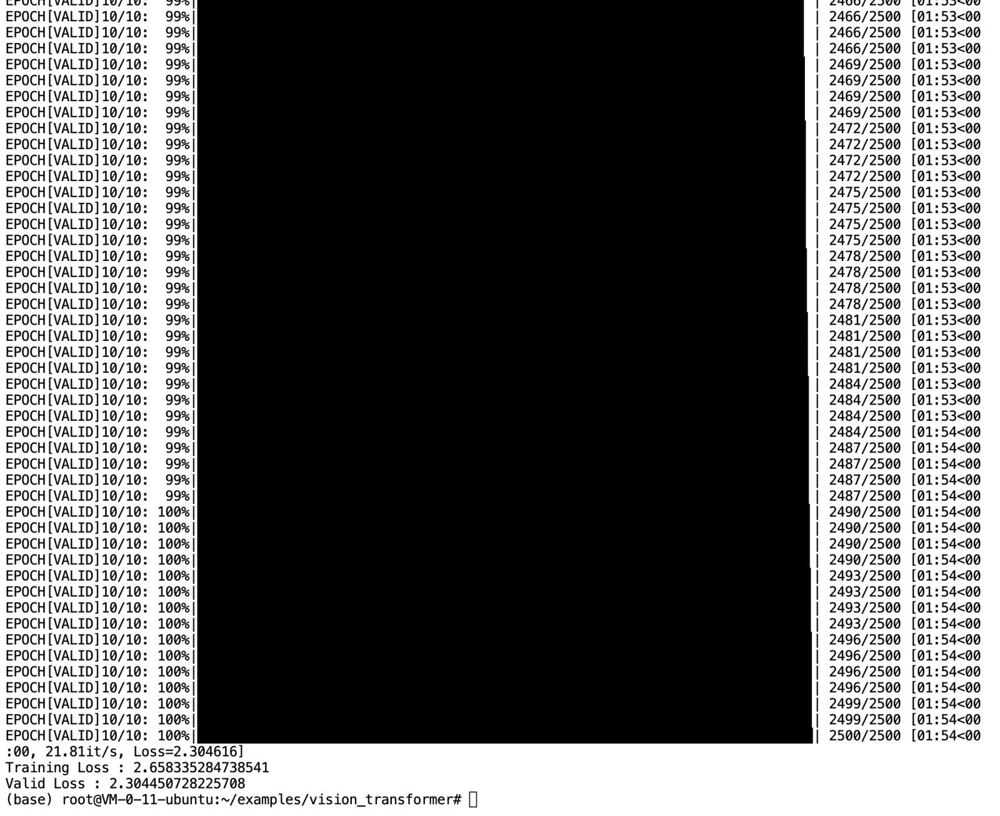

# PyTorch

## 一、概述

PyTorch 是一种用于构建深度学习模型的功能完备框架，是一种通常用于图像识别和语言处理等应用程序的机器学习。使用 Python 编写，因此对于大多数机器学习开发者而言，学习和使用起来相对简单。PyTorch 的独特之处在于，它完全支持 GPU，并且使用[反向模式自动微分](https://justindomke.wordpress.com/2009/03/24/a-simple-explanation-of-reverse-mode-automatic-differentiation/)技术，因此可以动态修改计算图形。这使其成为快速实验和原型设计的常用选择。 

## 二、快速开始

### 1. 操作步骤

Cloud Studio已内置PyTorch环境，您可以直接输入命令直接运行

```
# 切换到对应目录
cd /workspace/examples/vision_transformer

# 安装依赖
pip install -r requirements.txt

# 执行脚本
python main.py
```

注意：容器需要连接外网
当前实例加载的过程可能比较耗时（可能会超过2小时），耐心等待即可。

### 2. 运行结果查看

以下是PyTorch的运行结果截图：





## 三、  模板介绍

### 1.  文件结构

```
当前目录树默认为workspace目录，完整文件结构如下：
root/
├── workspace/ # Cloud Studio 内置示例文件，仅该文件夹变更支持持久化
│   └── Readme.md
│   └── examples
│       ├── CODEOWNERS
│       ├── LICENSE
│       ├── dcgan
│           └── ...
│       ├── fast_neural_style
│           └── ...
│       ├── gcn
│           └── ...
│       ├── legacy
│           └── ...
│       ├── CODE_OF_CONDUCT.md
│       ├── README.md
│       ├── gat
│           └── ...
│       ├── imagenet
│           └── ...
│       ├── language_translation
│           └── ...
│       ├── run_python_examples.sh
│       ├── run_cpp_examples.sh
│       ├── run_distributed_examples.sh
│       ├── utils.sh
│       ├── vision_transformer
│           └── ...
│       ├── word_language_model
│           └── ...
│       ├── docs
│           └── ...
│       └── cpp
│           └── ...
│       └── ...
│   └── img
│       └── ...
├── root/ # 一般模型文件存放在该文件夹
│   └── miniforge3 
│       └── ...
├── ...
```

### 2.  PyTorch官方文档与资源

（1）PyTorch 官方使用文档：

[PyTorch官网](https://pytorch.org/)

[GitHub - pytorch/pytorch: Tensors and Dynamic neural networks in Python with strong GPU acceleration](https://ollama.com/search)

[什么是 PyTorch？ | 数据科学 | NVIDIA 术语表](https://www.nvidia.cn/glossary/pytorch/)

（2）Cloud Studio操作指南：

[Cloud Studio（云端 IDE） 使用 GPU 开发-操作指南-文档中心-腾讯云](https://cloud.tencent.com/document/product/1039/111290)

## 三、  常见问题

### 1.  如何查看Web预览

#### 方法一：通过公网IP拼接端口号访问

可以通过指定 IP 及端口号创建服务后，通过公网 IP 拼接端口号查看 web 预览效果。

详情请查看：[Cloud Studio（云端 IDE） 使用 GPU 开发-操作指南-文档中心-腾讯云](https://cloud.tencent.com/document/product/1039/111290)

注意事项：

由于目前仅 HAI 进阶型及其他非免费版本可自定义开放端口，以下方法仅限 HAI 进阶型及其他非免费版本可用。

#### 方法二：通过code server提供的proxy访问

可以在当前页面浏览器地址后拼接proxy/{port}/查看 Web 预览效果

https://xxxxxx.ap-xxxxxx.cloudstudio.work/proxy/{port}/

注意事项：

此方式可能会出现样式丢失的问题，官方不建议使用。如果您仍要使用该方式，可以参考文档[Securely Access & Expose code-server | code-server Docs](https://coder.com/docs/code-server/guide#accessing-web-services)获取更多帮助。

### 2.  出现 CUDA out of memory 的错误提示怎么办？

模型文件加载需要占用显存资源。如：载入8B模型，需要约16G显存。基础型可用显存15G左右，如需载入8B及以上模型，建议购买 HAI 进阶型，或可使用 Ollama 模板，使用内存加载模型。

### 3.  为什么关机后没法开机了？

对于免费基础型，创建时会全地域寻找有算力的地域创建。创建完实例，所在区会固定，下次开机时所在区有资源才能开机。

目前免费高性能空间不支持迁移地域，如遇到所在区没资源时会出现无法开机的情况。如果需要保证稳定可开机，建议购买 HAI 基础型或进阶型。通过创建自定义应用，并在控制台具有算力的地域中，利用保存的自定义应用创建的方式，来完成地域迁移。

### 4.  其他问题

点击链接查看更多帮助文档： [Cloud Studio（云端 IDE） 常见问题-文档中心-腾讯云](https://cloud.tencent.com/document/product/1039/33505)

## 帮助和支持

##### 欢迎加入Cloud Studio用户反馈群

当您遇到问题需要处理时，您可以直接通过到扫码进入Cloud Studio用户群进行提问.

- 腾讯云工程师实时群内答疑

- 扫码入群可先享受产品上新功能

- 更多精彩活动群内优享


